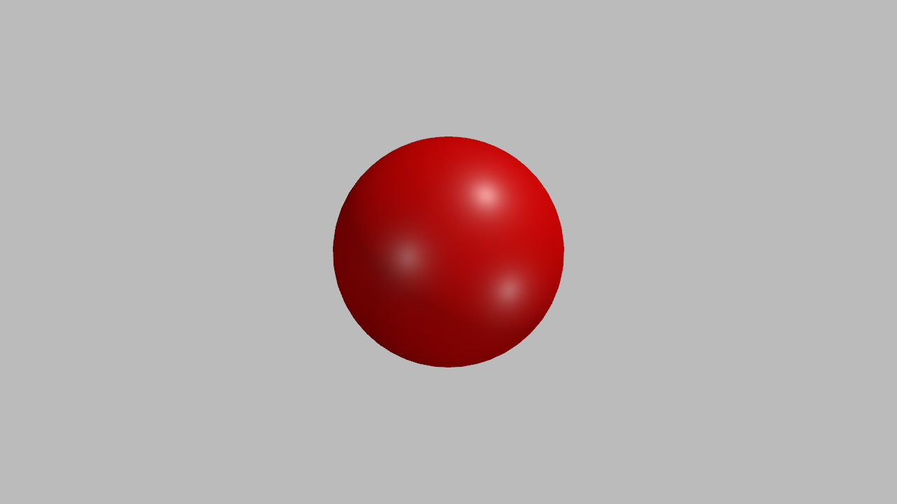
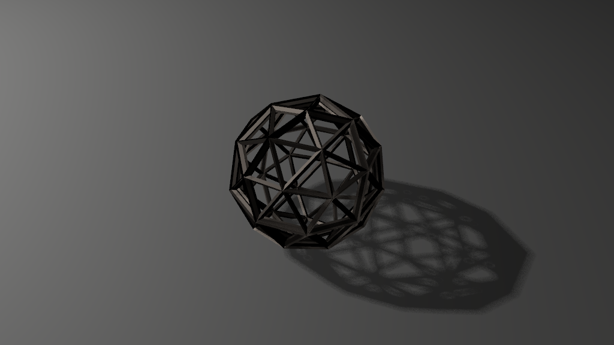
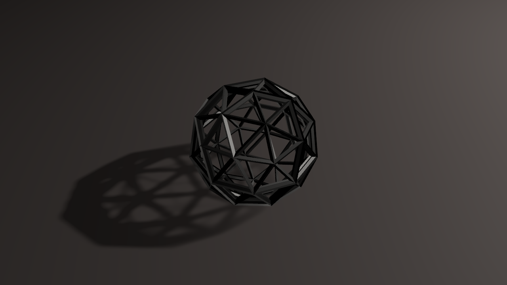
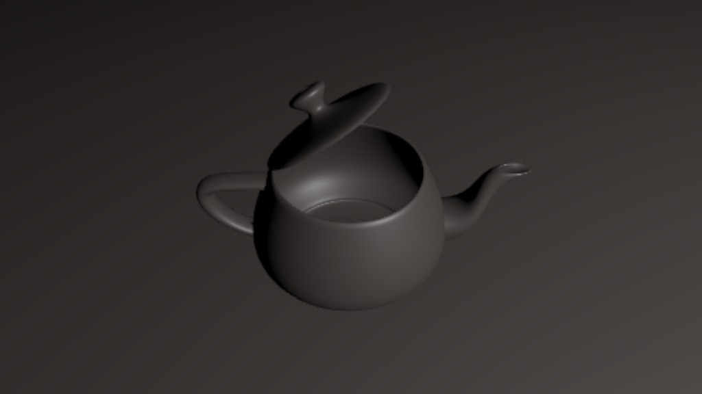
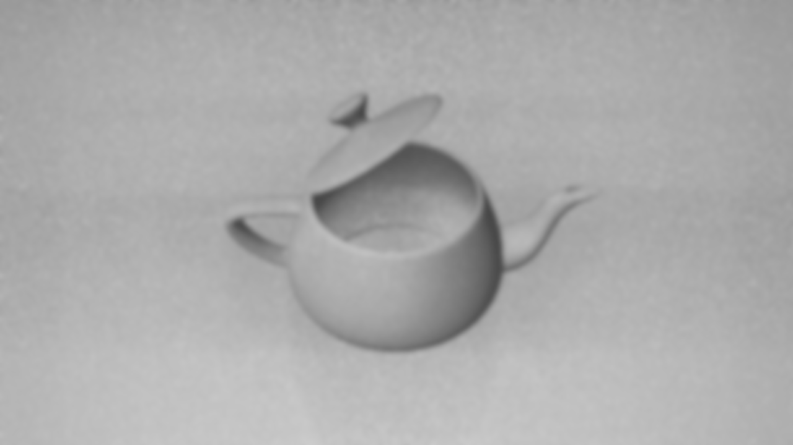
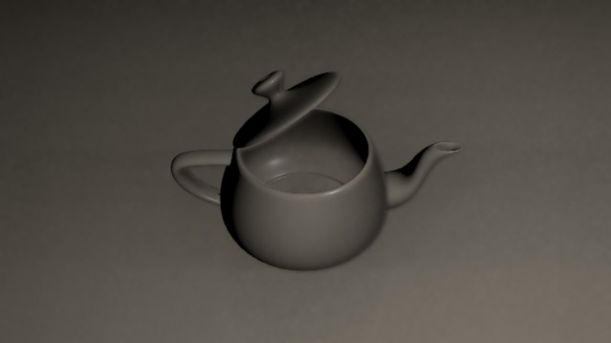
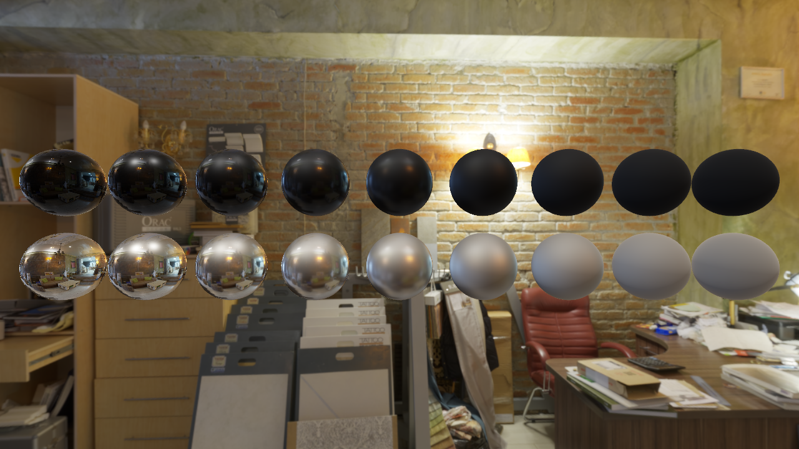
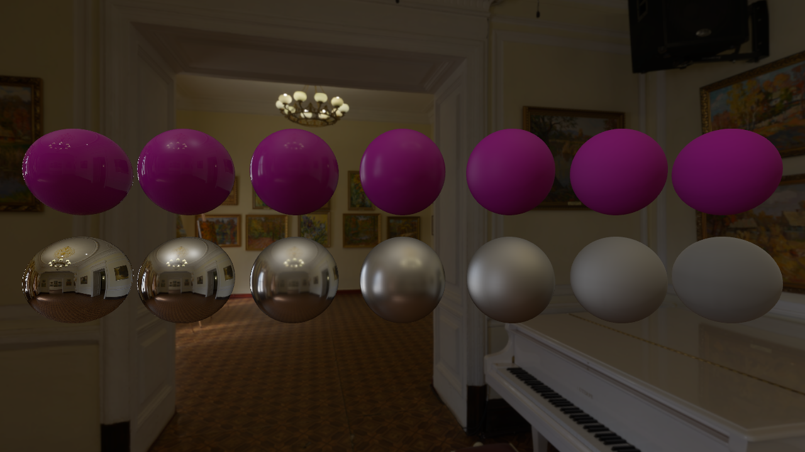
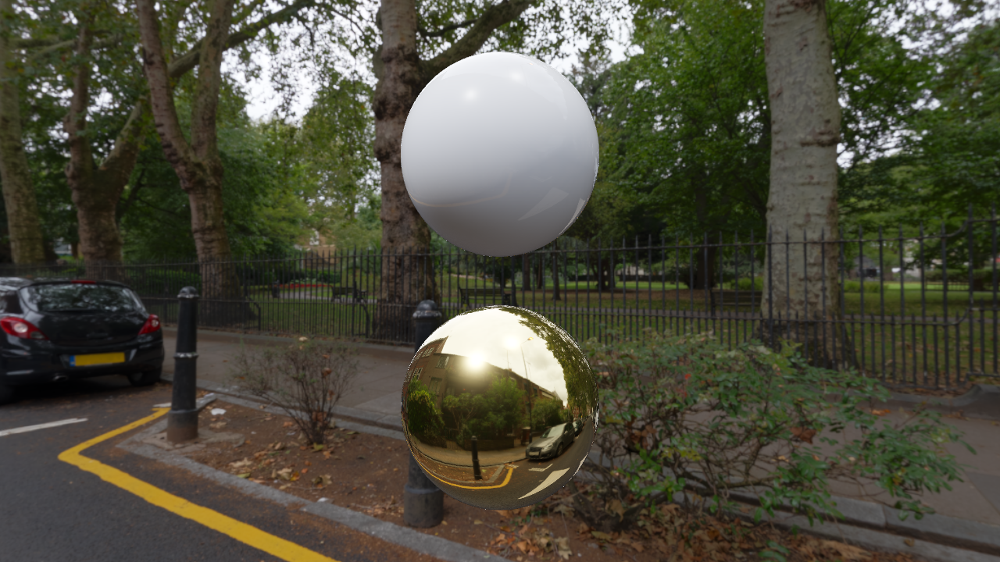

# ngl

ngl is a thin layer on top of low-level graphics/compute APIs.


## Graphics API

[ngl](ngl) contains the graphics API wrapper. It closely follows the Vulkan specification.

The only dependencies are system libraries (including a Vulkan driver) and the Zig standard library.


## Sample Programs

[sample](sample) contains sample programs that use ngl. Each subdirectory under [sample/src](sample/src) is a standalone executable.

```zig build -l``` lists the available samples.


### ADS Sample

Simple Phong shading.

[sample/src/ads](sample/src/ads)

```sh
cd sample && zig build ads
```


### PBR Sample

Simple physically based shading.

[sample/src/pbr](sample/src/pbr)

```sh
cd sample && zig build pbr
```




### PCF Sample

Shadow mapping with percentage closer filtering.

[sample/src/pcf](sample/src/pcf)

```sh
cd sample && zig build pcf
```




### VSM Sample

Variance shadow mapping.

[sample/src/vsm](sample/src/vsm)

```sh
cd sample && zig build vsm
```




### SSAO Sample

Screen space ambient occlusion.

[sample/src/ssao](sample/src/ssao)

```sh
cd sample && zig build ssao
```






### IBL Sample

Image-based lighting.

[sample/src/ibl](sample/src/ibl)

```sh
cd sample && zig build ibl
```




