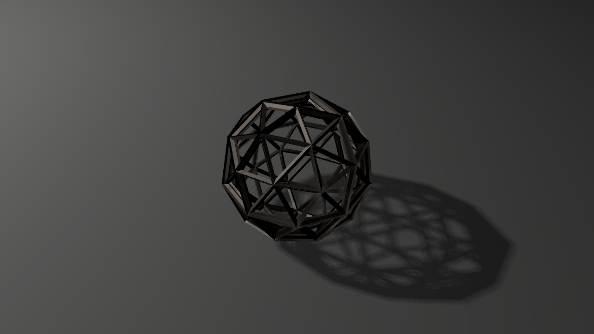
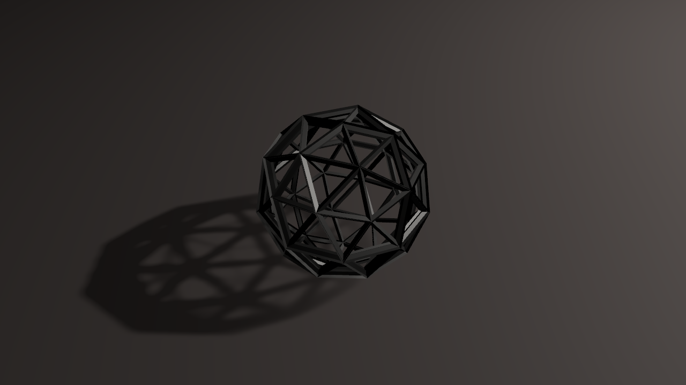

# ngl

[ngl/ngl](ngl) contains the graphics API wrapper.

[ngl/sample](sample) contains sample programs.


## ADS Sample
```sh
cd sample && zig build ads
```


## PBR Sample
```sh
cd sample && zig build pbr
```


## PCF Sample
```sh
cd sample && zig build pcf
```



## VSM Sample
```sh
cd sample && zig build vsm
```



## sRGB Sample
```sh
cd sample && zig build srgb
```


## Alpha Test Sample
```sh
cd sample && zig build mag
```


## Cube Map Sample
```sh
cd sample && zig build cube
```


## SSAO Sample
```sh
cd sample && zig build ssao
```


## HDR Sample
```sh
cd sample && zig build hdr
```


