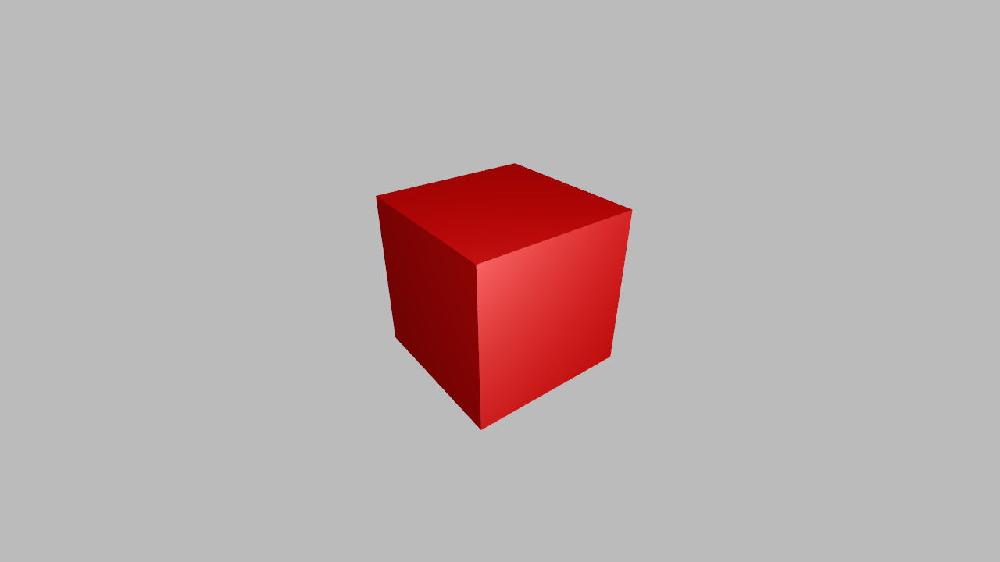
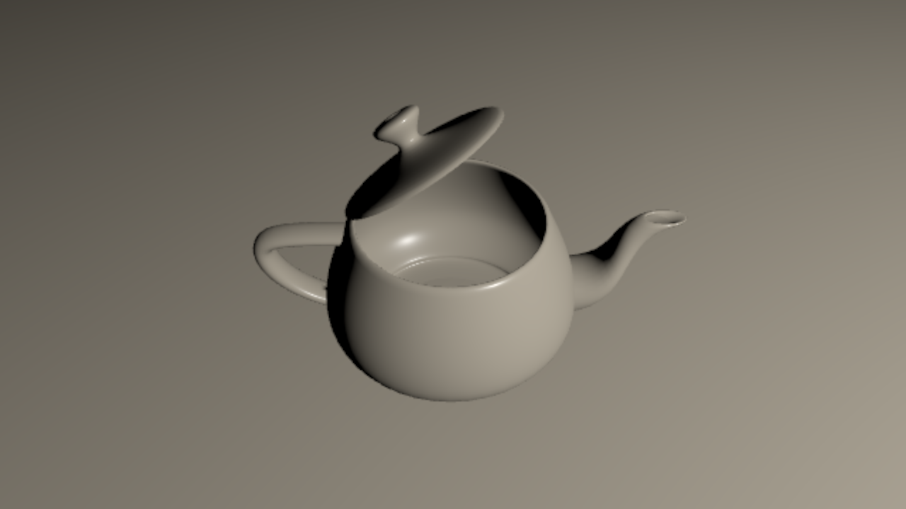
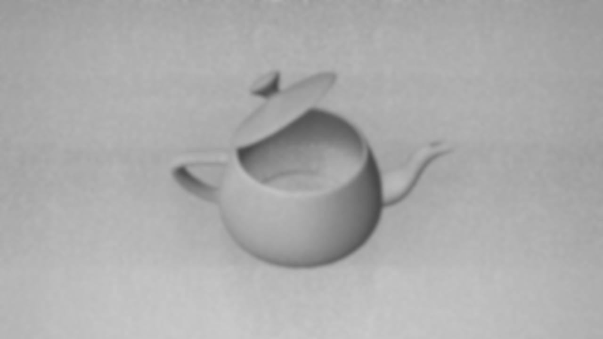

# ngl

[ngl/ngl](ngl) contains the graphics API wrapper.

[ngl/sample](sample) contains sample programs.


## ADS Sample
```sh
cd sample && zig build ads
```



## PBR Sample
```sh
cd sample && zig build pbr
```


## PCF Sample
```sh
cd sample && zig build pcf
```


## VSM Sample
```sh
cd sample && zig build vsm
```


## SSAO Sample
```sh
cd sample && zig build ssao
```




## IBL Sample
```sh
cd sample && zig build ibl
```


